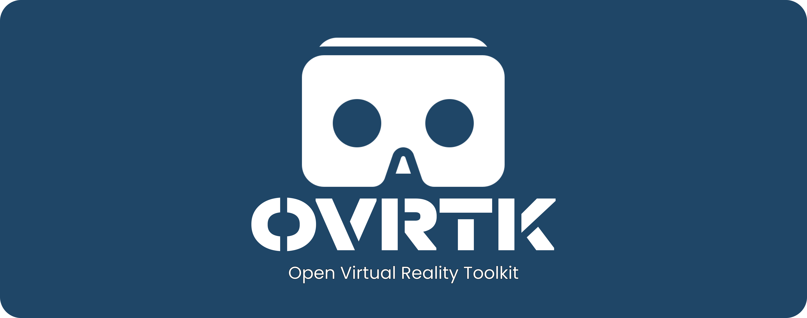

</img>
<h1 align="center">Onix Virtual Reality Toolkit</h1>

Introducing OVRTK - a cutting-edge Mobile based Virtual Reality Development Toolkit that utilizes the gyroscope of any mobile device to create a fully immersive VR experience. OVRTK allows users to explore and interact with virtual environments in stunning stereoscopic detail.

Developed as a research project, OVRTK is the result of months of dedicated experimentation and innovation. But it doesn't stop there - we are constantly seeking to improve and evolve our technology, and invite other developers to contribute their own ideas and expertise to help us push the boundaries of what's possible in the world of VR.

Whether you're a seasoned developer looking to explore new frontiers, or simply an avid VR enthusiast eager to dive into new worlds, OVRTK has something for everyone. So why wait? Join us on this thrilling journey into the future of Virtual Reality, and experience the power of OVRTK for yourself.

Documentation: https://priyanshu-1.gitbook.io/ovrtk/getting-started/introduction-to-ovrtk